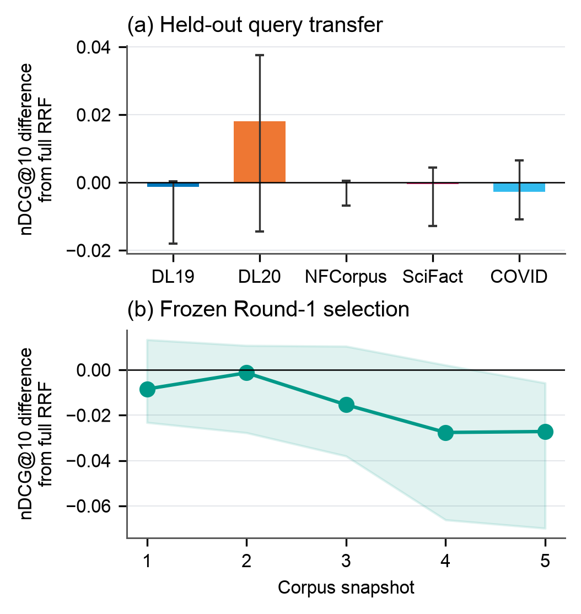

# 3 实验

## 3.1 实验设置

实验使用五个查询集的770条查询：TREC-DL 2019/2020、NFCorpus、SciFact 和 TREC-COVID；另在五轮 TREC-COVID 快照上评估同30条查询。我们回放 bge-small-en-v1.5 与 BM25（\(k_1=0.9\)、\(b=0.4\)）的精确排名，采用等权 RRF、名次贡献 \(1/(59+r)\) 和确定性同分规则。

DiBud 与 Balanced 使用相同的认证规则和访问预算，预算范围为128至10000。两种方法均逐条读取，Balanced 交替访问两条排名。我们统计前20条与前100条中的认证数量，以完成精确 Top-20 作为成本与质量参照。

静态回放使用重建的完整排名，770条查询均完成精确 Top-20。时间回放使用冻结的快照排名，不将保存末端视为通道耗尽。结果先在查询集内平均，再对各集合等权平均。所报告的95%置信区间使用2000次查询 bootstrap。

## 3.2 固定深度的迁移

我们评估 \(L\in\{10,20,50,100,200,500,1000,2000,5000\}\)。在同一 MS MARCO 语料上，\(L\) 从20增至5000，使 TREC-DL 2019 的 nDCG@10 从0.6538提高至0.6812，却使 TREC-DL 2020 从0.6424降至0.6243（图2a）。仅改变查询，加深窗口的收益就发生了反转。

对于五轮 TREC-COVID 快照中的同30条查询，最佳测试深度依次为50、100、200、200和5000（图2b）。随后，我们检验历史选择能否迁移：通过五折校准在第一轮选择 \(L\)，再固定用于各轮留出查询。相对完整 RRF，nDCG@10 差从第一轮的−0.0085变为第五轮的−0.0272（95%置信区间：[−0.0699, −0.0058]；图2c）。语料变化后，历史选定的深度未必能维持原有的相对质量表现。

图2：深度敏感性与迁移。(a) 同一语料上的不同查询。(b) 同一批查询在不同语料快照上的结果，使用各轮标注。圆圈标出测试范围内的最佳深度。(c) 第一轮选定的深度用于各轮留出查询。误差线为嵌套 bootstrap 95%置信区间，包含深度重选并保留跨轮查询对应关系。

## 3.3 固定 K 的访问成本

完成精确 Top-20 对多数查询成本较低，但尾部查询代价高昂（表1）。TREC-DL 2019 中，一半查询在311次访问内完成，P95却达到196410，最大值达到3533518，分别约为中位数的632倍和1.14万倍。TREC-DL 2020 与 TREC-COVID 也呈现同样的长尾，P95分别达到中位数的80倍和22倍。对多数查询成本可接受的K，对同一查询集中的其他查询可能代价高昂。因此，我们直接指定访问预算，在执行过程中决定返回数量，不再预设K。

## 3.4 同预算下的认证产出

我们先固定预算与认证规则，单独检验通道选择的作用。在相同的2048次访问预算下，DiBud 在五个查询集上均比均衡访问确认更多结果（表2）。按集合等权平均，前100条中的认证数量从41.77增至45.05，提高7.86%；前20条中从18.07增至18.18。因此，选择性读取能够在同一访问额度下获得更多精确位置。

## 3.5 相对精确 Top-20 的质量与成本

随后，我们考察要求固定返回数量的代价。比较同一读取轨迹的两种停止方式：完成精确 Top-20，或在预算耗尽时提前停止。通过五折校准，在校准查询上选择保留95%参考平均 nDCG@20 的最小预算，再用于留出查询。不足20条的位置按零增益计。

五个查询集保留了95.05%–97.68%的平均nDCG@20，同时减少65.92%–99.53%的访问量（表3）。两种停止方式采用相同的读取轨迹，因此这些节省来自提前停止。TREC-DL 2019 的访问量减少99.53%，体现了尾部查询高昂的完成成本。结果表明，完成全部20个位置并非保留大部分已测检索质量的必要条件。直接限制访问量、允许返回数量变化，可以保留大部分质量，同时省去大量完成成本。
