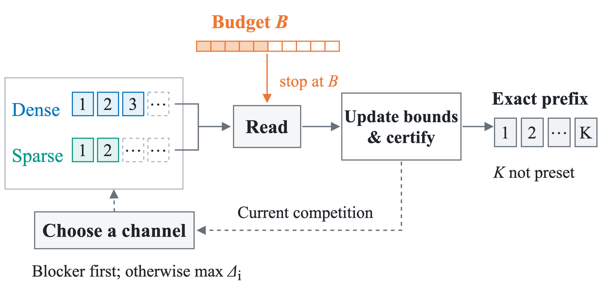

# 2 DiBud：预算约束下的精确前缀融合

给定查询、语料快照和读取预算 B，DiBud 从 Dense 与 Sparse 排名中按需读取，返回已认证的完整 RRF 排序前缀。预算决定最多读取多少，认证决定能够返回多少。

图1：DiBud方法概览。预算直接限制读取量，当前竞争指导通道选择，认证决定返回前缀。

## 2.1 预算与输出

记文档 x 在通道 i 的名次为 r_i(x)，RRF 的名次贡献为 g(r)=1/(c+r)，其中 c 为排名常数。完整融合分数为

\[
F(x)=\sum_{i\in\{D,S\}}g(r_i(x)),
\]

不属于某通道支持集的文档，在该通道贡献为零。按融合分数降序、同分按固定标识符顺序排列，得到完整序列 T*。两条通道提供同一快照下可续读的精确排名前缀。设已读深度为 d_D、d_S，输出为 A，则要求

\[
d_D+d_S\le B,
\qquad A=T^\star_{1:K},\quad K=|A|.
\]

K 无须预先指定，尚未确认任何结果时为空输出。这里的预算计量排名读取量。

其中，B 是请求输入，K=|A| 是执行过程中由认证确定的结果。精确性要求返回的 K 条结果与完整排序的前 K 条一致，而不预设 K。

## 2.2 前缀认证

记 S_i 为通道 i 已返回的文档集合。未出现文档在该通道的贡献至多为 u_i=g(d_i+1)；通道确认耗尽后，u_i=0。因此，已见文档 x 的分数上下界为

\[
\ell(x)=\sum_{i:x\in S_i}g(r_i(x)),
\qquad
h(x)=\ell(x)+\sum_{i:x\notin S_i}u_i.
\]

两条通道均未出现的文档，其分数至多为 h_∅=u_D+u_S。

从尚未输出的已见文档中选择下界最高者 x。若 ℓ(x) 超过其余文档的上界及 h_∅，便确认 x 为下一名，将其加入输出并继续检查。已见文档边界相等时按固定标识符顺序判定；对未见文档保持严格比较。每次输出都排除了所有剩余竞争者，因此累计结果始终与完整排序的对应前缀一致。确认下一名无须先确定后续位置，输出可以逐条增长，在预算耗尽时保留一个可返回的精确前缀。

## 2.3 读取与停止

下一名无法确认时，选择剩余竞争者中上界最高的文档 y。若 h(y)≥h_∅，且 y 仅缺少一条通道的贡献，则优先推进该通道，读取该通道可能找到 y，从而确定缺失贡献；若仍未找到，更深的读取位置也会降低这项贡献的上界。两种情况都为判断 y 是否仍会阻塞下一名提供信息。

否则，推进下一批能够使未读贡献上界下降更多的通道。对可读取 b 条且读取后仍开放的通道，下降量为 g(d_i+1)−g(d_i+b+1)。已耗尽通道不再读取，平分时按固定通道顺序选择。

每批读取后更新上下界，扩展已认证前缀。最后一批不超过剩余预算；最后一次允许的读取完成后，仍完成更新与认证，再在预算耗尽或所有通道耗尽时返回累计结果。调度影响预算内能够确认多少个位置，认证规则保证每个返回位置的精确性。
