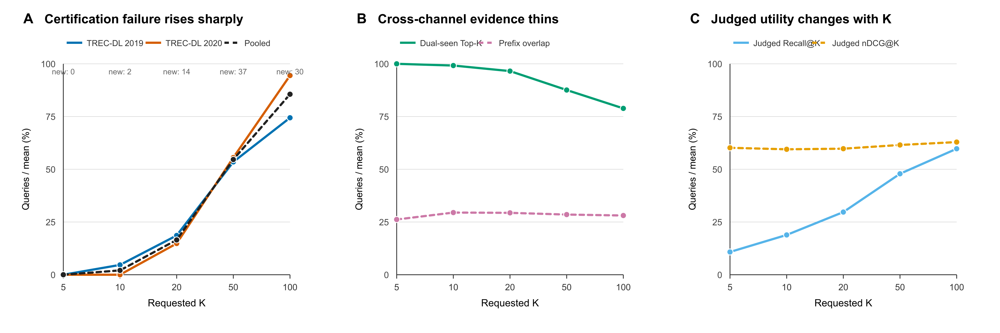

# Pilot analysis: why larger Top-K creates more certificate-poison queries

## Bottom line

The effect is real in the frozen EAHR evidence, and it is much broader than the
two previously identified latency outliers. Across all 97 judged TREC-DL
queries, the share whose exact balanced WRRF Top-K cannot be certified within
5,000 ranks per channel rises from 0% at K=5 to 85.57% at K=100. The transition
is steep rather than gradual: 2 queries first become censored at K=10, 14 at
K=20, 37 at K=50, and 30 at K=100; only 14 remain certifiable through K=100.

This is a logical certificate-depth result, not an online latency measurement.
Here, “poison” means only that the required balanced evidence depth is greater
than the available exact 5,000-rank prefixes.

## Pilot contract

- Real frozen EAHR target-validity artifacts, not mock data.
- TREC-DL 2019: 43 judged queries; TREC-DL 2020: 54 judged queries.
- Equal-weight two-channel WRRF with rank constant 60 and stable UUID tie order.
- Requested K in {5, 10, 20, 50, 100}.
- Exact Dense and positive-Sparse prefixes through rank 5,000.
- Every certified replay was checked against the frozen exhaustive ordered
  Top-K.
- Main replay uses batch size 16. Batch sizes 1 and 64 give identical censoring
  classifications and identical first-censored-K transitions.

## Main result

| K | Censored by 5,000 | Query-bootstrap 95% CI | Exceeds 1,000 | Exceeds 2,000 | First becomes censored |
|---:|---:|---:|---:|---:|---:|
| 5 | 0.00% | [0.00, 0.00] | 0.00% | 0.00% | 0 |
| 10 | 2.06% | [0.00, 5.15] | 6.19% | 4.12% | 2 |
| 20 | 16.49% | [9.28, 23.71] | 23.71% | 21.65% | 14 |
| 50 | 54.64% | [44.33, 64.95] | 73.20% | 65.98% | 37 |
| 100 | 85.57% | [78.35, 91.75] | 94.85% | 90.72% | 30 |

The trend replicates by year. At K=100, 74.42% of the 2019 queries and 94.44%
of the 2020 queries remain uncertified at depth 5,000.

## Why it happens

At balanced depth d, a document's known WRRF lower score is the sum of the
channel contributions already observed. If it has not yet appeared in one
channel, its upper score includes one possible missing contribution,
`1 / (d + 60)`. An entirely unseen document has upper score
`2 / (d + 60)`. Exact ordered Top-K is certified only when every selected
document's lower score dominates every remaining upper score, with the stable
tie rule also resolved.

Increasing K changes the boundary in two coupled ways:

1. The Kth fused score moves downward, leaving less margin over competitors.
2. The enlarged fused set contains more documents supported high in only one
   channel. Their missing opposite-channel ranks can remain unresolved far down
   the other list, so their upper scores can still reorder the boundary.

The data match that mechanism:

- The mean fraction of exhaustive fused Top-K documents observed in both
  channel prefixes falls from 100.00% at K=5 to 78.88% at K=100.
- Lower Dense/Sparse prefix overlap is associated with larger depth lower
  bounds at every K (pooled Spearman rho from -0.51 to -0.64).
- Median opposite-channel rank is strongly associated with difficulty at
  K=10, 20, and 50 (rho = 0.80, 0.80, and 0.74).
- At K=50, dual-channel support has rho = -0.85 with difficulty and the
  terminal certificate slack has rho = -0.80.
- Every failure at depth 5,000 is classified as a **seen-competitor** ambiguity;
  none is caused solely by the anonymous unseen-document bound. The practical
  bottleneck is therefore unresolved cross-channel evidence for documents
  already seen in at least one list.

The original two outliers are early members of this larger transition:

- Query 855410 certifies at depth 16 for K=5 but is censored beyond 5,000 from
  K=10 onward. Its dual-seen fraction drops from 1.00 to 0.50 at K=10.
- Query 443396 certifies at depth 704 for K=10 but is censored beyond 5,000 at
  K=20. Its dual-seen fraction falls to 0.75 at K=20 and 0.33 at K=100.

So the “toxic” behavior is not primarily a property of two pathological query
texts. It is an interaction among requested K, cross-channel rank disagreement,
and the proof obligation of exact ordered fusion.

## Larger K is not simply bad

Judged relevance coverage increases with K: pooled mean judged Recall@K rises
from 10.78% at K=5 to 59.74% at K=100. Mean judged nDCG@K stays around
0.59–0.63. Because the TREC judgments are incomplete and the metric cutoff
changes with K, these values are descriptive rather than a policy objective.
They do show why the next problem is **adaptive K**, not merely “always use a
small K”: relevance coverage and exact-certification cost evolve on different
curves and differ by query.

## What this pilot does and does not establish

Established:

- The Top-K poison-rate curve exists in two real TREC-DL query sets.
- It is invariant to certificate batch sizes 1, 16, and 64 at the 5,000-depth
  censoring boundary.
- The dominant offline failure mode is unresolved ordering among already-seen,
  often one-channel-supported candidates.

Not yet established:

- Wall-clock latency or server continuation overhead at K=50 and K=100.
- Behavior beyond depth 5,000 for censored queries.
- Generalization to other fusion weights, rank constants, datasets, or hybrid
  retriever pairs.
- A learned or rule-based K selector.

## Recommended next run

The next online experiment should stratify queries by first-censored K and run
EAHR at K={10,20,50,100} on a small balanced sample from each stratum. It should
record wall time, per-channel stopping depth, continuation calls, judged gain,
dual-seen fraction, and opposite-channel ranks. That run tests whether the
logical transition measured here is also the mechanism behind the latency
transition and supplies the target for a query-adaptive K policy.

## Data products

- Per-query records: `results/derived/topk_pilot_per_query.csv`
- Aggregate curve: `results/derived/topk_pilot_aggregate.csv`
- Mechanism correlations: `results/derived/topk_pilot_mechanisms.csv`
- First-transition table: `results/derived/topk_pilot_transitions.csv`
- Source and output hashes: `results/raw/source_manifest.json`
- Reproduction: `scripts/run_topk_pilot.py`
- Figure generation: `scripts/plot_topk_pilot.py`
